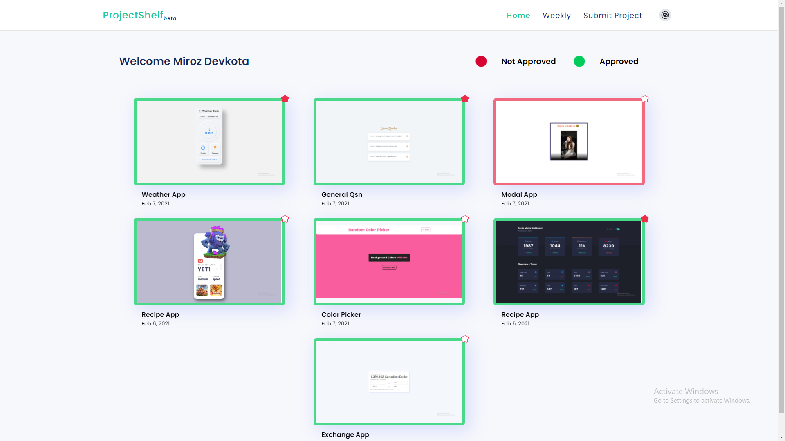

# Project Shelf

## Video

https://www.loom.com/share/a3462435a4ce4b1881289dd78e55cf43

### Description

This project is intended to be a resource based website for a community of developers who are looking to learn from each other. The idea is to allow people who are learning new tech to host their project publically to showcase them and for other people to see and learn from what has been done and what they can learn from it.

### First time running the app

- Run  `docker run --detach --publish 5432:5432 -e POSTGRES_PASSWORD=postgres --name postgres postgres:10.12`  to start PostgresQL.

- Run  `yarn run migrate`  to create the database.

### Start the app

- `yarn dev`
- `yarn dev:client` to only start the client.  `yarn dev:backend` for only start the server.

### Built With

- [React JS](https://reactjs.org/)
- [React Router](https://github.com/ReactTraining/react-router)
- [GraphQl](https://graphql.org/)
- [Apollo Graphql](https://www.apollographql.com/)
- [React Hook Form](https://react-hook-form.com/)
- [Styled Components](https://www.styled-components.com)
